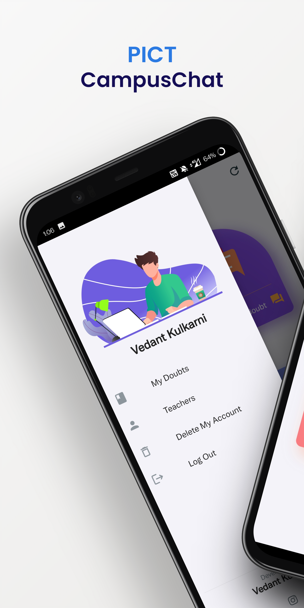
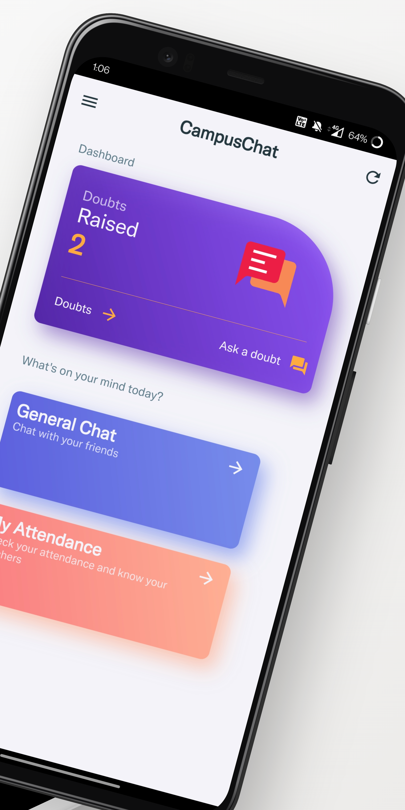
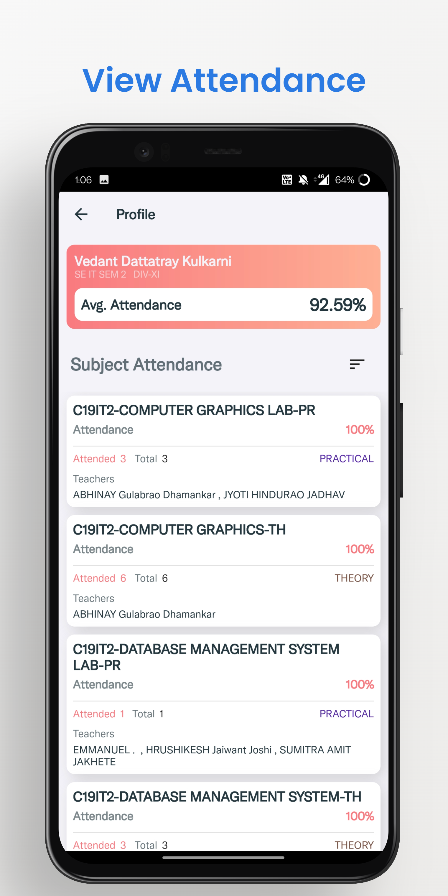
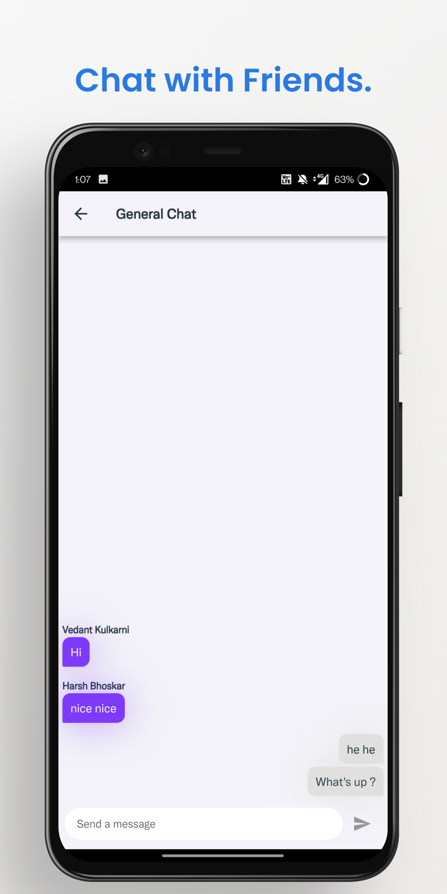
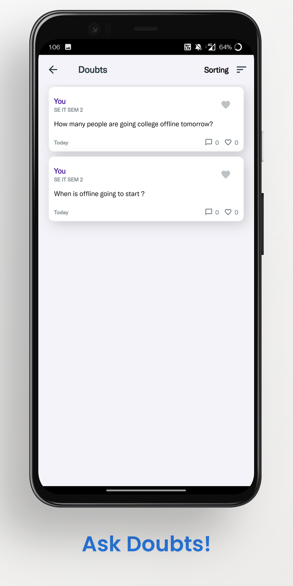
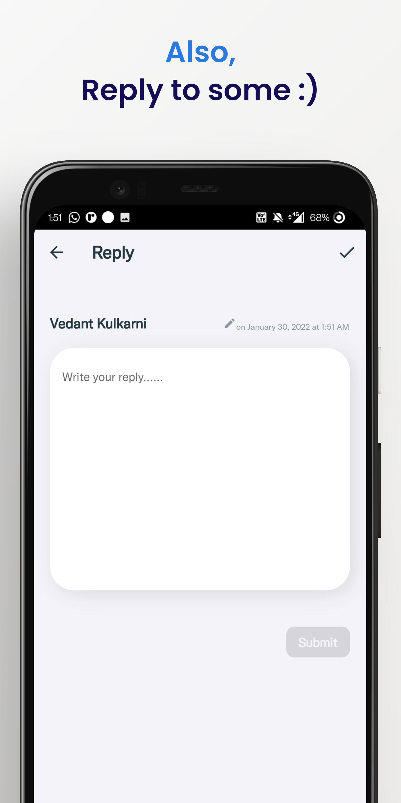

 

  

  <h1 align="center">CampusChat</h1>

  

    Get your doubts cleared the right way!
     
        
  

  

## About

I just wanted to push my own limits with this app. It started as a fun and learn kind of project but eventually it became one of my best development projects so far. I have majorly focused on UI and UX in this app - material design, animations and stuff.
The app is essentially a doubts platform where students can get their doubts cleared. Apart from this the app also provides group chatting services and PICT students can view their latest attendance, in real-time.
The app is entirely powered by Google's Firebase as backend. Also the app is made in Flutter framework which is again, backed by Google, apparently, and therefore the backend and the frontend integrate seamlessly with each other resulting in a faster app.

 
 

## Play Store Link 
 https://lnkd.in/dbhEKwZ2

## Built With🛠️

 
 
 

 

## Features💻

- Pune Institute of Computer Technology(PICT) Students can view their attendance by signing up with their MIS Portal Credentials.
- Doubt platform can be used for solving even the simplest and silliest of doubts.
- General Chat section provided for group discissions.

 

## Screenshots🚀

|**Manage Account**|**Home Screen**|
|---|---|
|||

|**View Your Attendance**|**Chat With Your Friends**|
|---|---|
|||

|**Ask Some Doubts**|**Reply To People!**|
|---|---|
|||

 

## Contributing:hugs:

Contributions are what make the open source community such an amazing place to be learn, inspire, and create. Any contributions you make are **greatly appreciated**.
* If you have suggestions for adding or removing projects, feel free to [open an issue](https://github.com/vedantkulkarni/CampusChat/issues/new) to discuss it, or directly create a pull request after you edit the project file with necessary changes.
* Please make sure you check your spelling and grammar.

### Creating A Pull Request 🛠️
1. Raise an issue and get assigned.
2. Fork the Project
3. Create your Feature Branch (`git checkout -b feature/AmazingFeature`)
4. Commit your Changes (`git commit -m 'Add some AmazingFeature'`)
5. Push to the Branch (`git push origin feature/AmazingFeature`)
6. Open a Pull Request

 

## Authors

* **Vedant Kulkarni** - *Information Technology Student* - [Vedant Kulkarni](https://github.com/vedantkulkarni) 

 

## Connect with me:

  
 

# I'd really appreciate if you give this repo a  🌟 Thank You 😊
